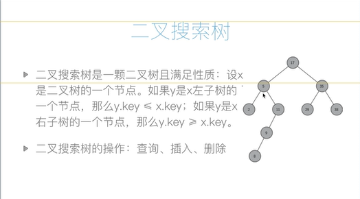

**一、概念：**
二叉搜索树是一颗二叉树且满足性质：设x是二叉树中的一个节点。如果y是x的左子树的一个节点，那么y.key <= x.key；如果y是x右子树的一个节点，
那么y,key >= x.key

二叉搜索树的操作：查询、插入、删除
**插入**
class BiTreeNode(object):
    def __init__(self,data):
        self.data = data
        self.left = None
        self.right = None
#   双链表的形式
        self.parent = None
class BST:
    def __init__(self):
        self.root = None
    # 递归的节点插入
    def insert(self,node,val):
        if not node:
            node = BiTreeNode(val)
        elif val < node.data:
            node.lchild = self.insert(node.lchild,val)
            node.lchild.parent = node 
        elif val < node.data:
            node.rchild = self.insert(node.rchild,val)
            node.rchild.parent = node
        else:
            pass
        return node
    # 非递归的节点插入
    def insert_no_rec(self,val):
        p =self.root
        if not p:
            self.root = BiTreeNode(val)
            return
        # 插入的节点是一定在叶子节点中的
        while True:
            if val < p.data:
                if p.lchild:
                    p = p.lchild
                # 走了这一个else分支说明找到了查找的位置，说明需要执行插入操作；
                # 插入的节点一定是在叶子节点
                else:
                    p.lchild = BiTreeNode(val)
                    p.lchild.parent = p
                    return
            elif val > p.data:
                if p.rchild:
                    p = p.rchild
                # 走了这一个else分支说明找到了查找的位置，说明需要执行插入操作；
                # 插入的节点一定是在叶子节点
                else:
                    p.rchild = BiTreeNode(val)
                    p.rchild.parent = p
                    return
            # 如果是val和遍历到的某节点的值相同的情况，那就什么都不做，直接return。就如同集合操作，重复的节点不进入集合中。
            else:
                return

**查询**
    # 递归的查询
    def query(self,node,val):
        if not node:
            return None
        if node.data < val:
            return self.query(node.rchild,val)
        elif node.data > val:
            return self.query(node.lchild,val)
        else:
        return node
    # 非递归的节点查询
    def insert_no_rec(self,val):
        p = self.root
        while p:
            if p.data < val:
                p = p.rchild
            elif p.data > val:
                p = p.lchild
            else:
                return p
        return None
**删除**
1.被删除的节点是叶子节点，就直接删除，不会改变二叉搜索树的性质
2.被删除的节点只有一颗左子树或只有一颗右子树（即只有一个孩子），将此节点的父亲与孩子连接。然后删除该节点。
3.被删除的节点有两个孩子，将其右子树的最小节点（该节点最多有一个右孩子）删除，并替换当前节点。

对于二叉搜索树而言，删除操作可交换吗？可交换的含义是，先删除x再删除y留下的结果树与先删除y再删除x留下的结果树完全一样。如果是，说明为什么？
否则，给出一个反例。答案是否，从2、3两种情况举例：https://www.coder.work/article/1916607
# 参数不是Val，而是Node（因为是删除节点）,这是删除的第一种情况
    def __remove_node_1(self,node):
# node是叶子节点
        if not node.parent:
            self.root = None
        if node == node.parent.lchild:
            #node是它父亲的左孩子
            node.parent.lchild =None
            node.parent = None
        else:
            node.parent = None
    def __remove_node_21(self,node):
# node只有一个左孩子
        if not node.parent:
            self.root = node.lchild
            node.lchild.parent = None
        elif node == node.parent.lchild:
# 二叉树之间的节点连接如同链表（链式存储结构），删除节点的操作：
            node.parent.lchild = node.lchild
# 不是很明白这里为什么还要连回去？二叉树不也是一个链式存储结构吗，不过双链表的删除确实是需要这两行代码的，但是二叉树不是单链表吗
            node.lchild.parent = node.parent
        else:
            node.parent.rchild = node.lchild
            node.lchild.parent = node.parent

    def __remove_node_21(self,node):
# node只有一个右孩子
        if not node.parent:
            self.root = node.rchild
        elif node == node.parent.lchild:
# 二叉树之间的节点连接如同链表（链式存储结构），删除节点的操作：
            node.parent.lchild = node.rchild
# 不是很明白这里为什么还要连回去？二叉树不也是一个链式存储结构吗，不过双链表的删除确实是需要这两行代码的，但是二叉树不是单链表吗
            node.lchild.parent = node.parent
        else:
            node.parent.rchild = node.lchild
            node.lchild.parent = node.parent
            
        